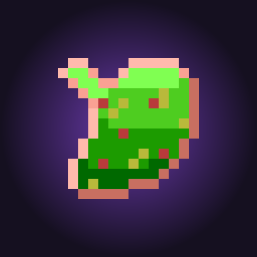

<div align="center">



# Reflux Storage

**A portable reflux tank that turns stored pressure into burp jumps.**

[](https://www.minecraft.net/)
[](https://neoforged.net/)
[](LICENSE)

</div>

## What it does

Reflux Storage adds a single carryable item, also named **Reflux Storage**. While the item is in a player's inventory or an optional Curios slot, it slowly accumulates reflux like a pressure battery. Right-clicking the item or pressing its configurable use key spends stored reflux to launch the player upward with a burp.

- Stores up to `8000 mB` of reflux.
- Charges `25 mB` per second while carried.
- Burp power ranges from `1` to `20`.
- Each power level costs `100 mB`.
- Right-click launches vertically while preserving the player's current horizontal movement.
- The configurable `Use Reflux Storage` keybinding starts unbound in Controls and can activate the item from the player's inventory.
- The configurable `Adjust Burp Power` keybinding starts unbound in Controls. Press it to increase power; hold Sneak while pressing it to decrease power.
- If Curios is installed, the item can be equipped in `belt` or `charm` slots and will charge/use from there too. Curios is optional; without it, vanilla inventory behavior is unchanged.
- Sneak + mouse wheel adjusts burp power while holding the item.
- The item durability bar shows stored reflux.
- Burp sounds use three tiers: power `1` uses the weak sound, powers `2-19` use the medium sound with scaled volume, and power `20` uses the strong sound.
- The item icon has five capacity textures: `0%`, `25%`, `50%`, `75%`, and `100%`.

## Stack

| Piece | Version |
|-------|---------|
| Minecraft | 1.21.1 |
| NeoForge | 21.1.219 |
| Java | 21 |
| Build | Gradle 8.14 Kotlin DSL |
| Sound tooling | Bun + ElevenLabs + ffmpeg |

## Item textures

The Reflux Storage item uses a client-side item predicate named `reflux_storage:stored` to switch models as stored reflux crosses each capacity threshold. Texture files live in `src/main/resources/assets/reflux_storage/textures/item/`:

- `reflux_storage_0.png`
- `reflux_storage_25.png`
- `reflux_storage_50.png`
- `reflux_storage_75.png`
- `reflux_storage_100.png`

## Building from source

```bash
./gradlew build
./gradlew runClient
```

The built jar lands in `build/libs/`.

## Trailer command helpers

Trailer-only command functions live in `tools/trailer-datapack/`. They are not packaged into the mod jar. Copy that folder into a world's `datapacks/` folder when recording trailer shots, then run `/reload` in-game.

The functions replace the item in your main hand with a preset charge level so you do not need to wait for passive charging.

```mcfunction
/function reflux_storage:trailer/charge_0
/function reflux_storage:trailer/charge_25
/function reflux_storage:trailer/charge_50
/function reflux_storage:trailer/charge_75
/function reflux_storage:trailer/charge_100
```

These commands only replace the `Reflux Storage` item in your main hand. Burp power can still be adjusted with the normal keybinds.

## Crafting

Reflux Storage is crafted with rotten flesh, sugar, and a bucket:

```text
rotten_flesh  sugar  rotten_flesh
rotten_flesh  sugar  rotten_flesh
rotten_flesh  bucket rotten_flesh
```

## SoundLab

SoundLab is a small local web UI for generating and auditioning mod sounds through ElevenLabs. Reflux Storage currently has four sound slots: `burp_weak`, `burp_medium`, `burp_strong`, and `empty`.

```bash
bun tools/soundlab.ts
PORT=7778 bun tools/soundlab.ts # if 7777 is already in use
```

Open `http://localhost:7777`, generate candidates, install the chosen take, then press `F3+T` in-game to reload resources.

SoundLab reads `ELEVENLABS_API_KEY` from the environment or from `~/.claude/.env`. Installed sounds are written to `src/main/resources/assets/reflux_storage/sounds/reflux_storage/`.

## Design notes

The first playable loop is intentionally item-only. There are no controller blocks, tanks, block entities, or storage networks yet. Food-based reflux generation, custom sounds, particles, fall-damage tuning, and a richer UI can build on this loop after the vertical launch feels good.

## License

[MIT](LICENSE) Copyright 2026 Abe
